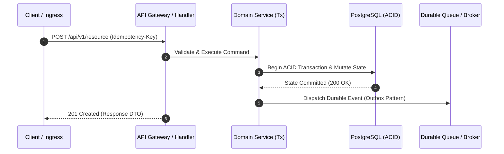
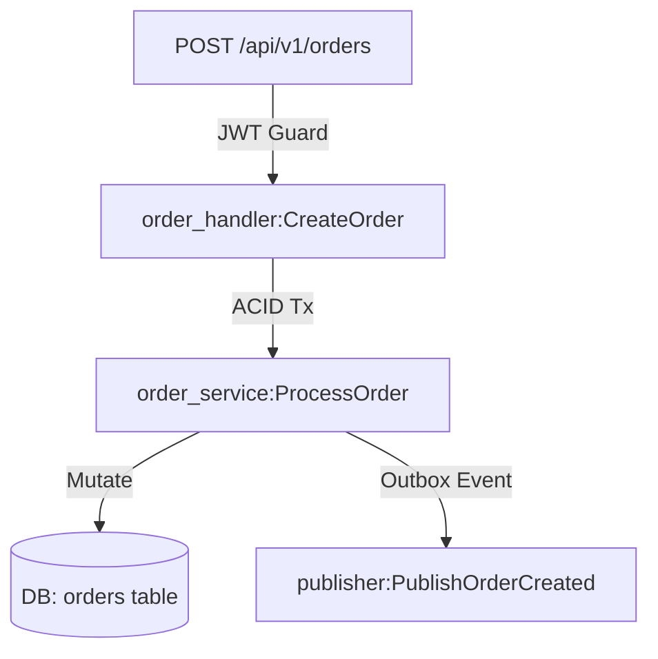

# Template Artefak (World-Class Principal Engineer Standard)

Kerangka di bawah WAJIB diikuti persis. §5 `AGENTS.md` menunjuk ke sini. Dokumen arsitektur dan perencanaan bukan sekadar formalitas, melainkan instrumen pertahanan sistem (*defense-in-depth*) untuk menjamin nol *downtime*, nol *data corruption*, dan kepastian *failure modes*.

## 🔗 Posisi dalam Rantai Kerja

Skill ini dipakai **dua kali**: di tahap 3 untuk menulis rencana, dan di tahap 6 untuk membuktikan hasilnya.

| # | Tahap | Dokumen |
| :-: | :--- | :--- |
| 1 | Routing task | `AGENTS.md` §2 |
| 2 | Pilih stack & arsitektur | `master-decision-tree/SKILL.md` |
| 3 | **Tulis `docs/rfc/YYYYMMDD-<fitur>.md` + katalog** | **`templates/SKILL.md` bagian 1–2 — Anda di sini** |
| 4 | **BERHENTI — tunggu user mengetik "Gasskan"** | `AGENTS.md` §0.5 · **GERBANG MUTLAK** |
| 5 | Branch, atomic commit, merge | `git-workflow/SKILL.md` bagian 1–5 |
| 6 | **Patch Receipt + centang Kanban di RFC** | **`templates/SKILL.md` bagian 6 — Anda di sini lagi** |

> Nomor **§** selalu merujuk `AGENTS.md`. Untuk seksi milik skill lain dipakai kata "bagian".

**Empat rute §2 `AGENTS.md` MENGGUGURKAN tahap 3–4. DILARANG memaksakan RFC di sana:**

| Rute §2 | Yang berlaku |
| :--- | :--- |
| Proyek baru **kecil** (4 syarat §2) | RFC & Day-0 Quintet DILARANG dipaksakan → langsung tahap 5 |
| Edit **≤3 berkas**, bugfix, refactor minor, investigasi | DILARANG bikin RFC → langsung tahap 5. Bugfix tetap WAJIB Proof-of-Defect (§0.6) |
| **In-Flight Fix** — >3 berkas tapi berasal dari RFC yang SUDAH disetujui | **DILARANG buat RFC kedua.** Catat perubahannya di seksi task RFC yang sedang aktif |
| **Emergency Pause** — blocker arsitektural kritis di tengah eksekusi | BERHENTI. Susun `docs/rca/YYYYMMDD-<insiden>.md` (bagian 3 di bawah), lapor ke user, jangan putuskan sepihak |

**Tiga sambungan yang WAJIB dijaga konsisten:**
- Field **Target Branch** (bagian 1 di bawah) WAJIB memakai konvensi penamaan `git-workflow/SKILL.md` bagian 1 (Git Flow), dan WAJIB sama persis dengan branch yang benar-benar dibuat.
- Opsi di **§2 Eksplorasi Arsitektur** adalah keluaran `master-decision-tree/SKILL.md` — DILARANG mengarang opsi tanpa melewati pohon itu.
- Tiap **Batch** di §4 memetakan ke satu atau lebih commit atomik (`git-workflow` §5); status `[x]` hanya boleh dicentang setelah batch itu lolos Quality Gate **dan** ter-commit.

---

## 0. All-Out Principal Planning Protocol (The AETHERIS Master Key Formula)

Saat merancang arsitektur baru, membuat fitur rumit, atau menyusun Grand Blueprint / RFC, AI dan Subagent **WAJIB MENGETINGGALKAN SELURUH PEMBATASAN KETAT ONGKOS TOKEN DALAM MENJAWAB**. Anggaplah pesan *default* user senantiasa berbunyi: *"Silakan memasak, time is yours. Buatkan paling lengkap dari 5W1H dengan penanganan semua edge cases tanpa terkecuali."*

### 5 Pilar Wajib (L8 Principal Standard):
1. **First-Principles & 5W1H:** Jangan pernah melompat ke sintaks tanpa merancang landasan filosofis mengapa arsitektur atau teknologi tersebut dipilih.
2. **Adversarial Anticipation:** Jangan mengacu pada *happy-path*. Bangun desain dengan asumsi akan diuji/dibantai oleh pengamat teknikal kritis; setiap pilihan teknikal wajib disertai justifikasi mendalam dan analisis trade-off jujur.
3. **Exhaustive Inventory Grounding (Anti-Zero-Shot):** Lakukan audit referensi lokal (`references/`) dan sumber daya eksisting untuk memaparkan seluruh entitas/opsi domain komplit ke dalam klaster taksonomi spesifik sebelum merinci abstraksi kodenya. Hal ini menjamin 0% pemotongan karena *lost-in-the-middle bias*.
4. **Zero-Exception Anomaly Hunting (Edge Cases):** Pada setiap dokumen perancangan, eksplorasi kasus tepi (*edge cases*) tidak boleh diabaikan atau diringkas dengan `// dll`. WAJIB memetakan minimal 5–10 anomali operasional (disk penuh, permission denied, race condition, network disconnect, korupsi konfigurasi, koneksi terputus, atau anomali struktur folder legacy) beserta mitigasi eksplisitnya.
5. **Visual Architecture Blueprinting (Mermaid Grounding):** DILARANG menjelaskan alur sistem multi-komponen, state machine, atau skema database kompleks hanya dengan teks tebal/ASCII biasa. WAJIB mempresentasikan diagram visual eksplisit dalam blok kode `mermaid` (Flowchart, Sequence Diagram, atau ERD/Class Diagram) agar arsitektur tergambar presisi, tidak ambigu, dan siap untuk audit klinis.

---

## 1. `docs/rfc/YYYYMMDD-<nama-fitur>.md` (All-in-One RFC / PRD / Batch Task)

Dokumen tunggal terpadu untuk perancangan fitur baru, refactor besar, atau inisiasi proyek (Greenfield/Brownfield). Menggabungkan **Kebutuhan Bisnis (PRD)**, **Arsitektur Teknis (RFC)**, dan **Checklist Eksekusi Batch (Task)** dalam satu berkas abadi di folder `docs/rfc/`.

```markdown
# RFC: <Judul Fitur atau Inisiatif Sistem>

- **Status:** `PROPOSED` | `ACCEPTED` | `IMPLEMENTED` | `SUPERSEDED`
- **RFC Tier (T-Shirt Size):** `Tier 1 (Full RFC)` | `Tier 2 (Mini RFC 1-Pager)`
  <!-- Tier 1: Perubahan arsitektur/DB, high-load, breaking API. Tier 2: Penambahan endpoint sederhana, minor rework -->
- **Tanggal:** YYYY-MM-DD
- **Target Branch:** `feature/<nama-fitur>`
- **RACI Governance Matrix (Top 1% VP Standard):**
  - **Responsible (Author):** AI Main Agent / Lead Engineer
  - **Accountable (Approver):** User / Principal Architect (Menunggu kata "Gasskan")
  - **Consulted (Security & QA):** Adversarial QA Subagent / Domain Mastery Reference
  - **Informed (Stakeholders):** Tim Operasional, Tim Frontend, Tim Support

---

## 1. Konteks & Problem Statement (PRD & AWS Working Backwards Core)
- **Latar Belakang & Urgensi:** <!-- Masalah nyata yang dipecahkan, dampak bisnis/sistem, dan alasan kenapa harus dikerjakan sekarang -->
- **Scope Boundaries:**
  - **IN-SCOPE:** <!-- Fitur, modul, endpoint, dan kapabilitas konkret yang akan dibangun -->
  - **EXPLICIT NON-GOALS:** <!-- Batasan keras hal-hal yang sengaja TIDAK dikerjakan pada inisiatif ini untuk mencegah scope creep -->
- **Asumsi Epistemik & Skala (Hasil Gerbang Klarifikasi §2):**
  - **Target Throughput / Load:** `[fakta/inferensi/spekulasi]` <!-- misal: 2.500 RPS peak, 50jt records/hari -->
  - **Latency SLA:** `p95 < 50ms`, `p99 < 150ms`
  - **Asumsi Sistem & Tenant:** <!-- B2B/B2C, multi-tenant RLS, single-region/multi-region, RPO/RTO target -->
- **AWS Working Backwards (Adversarial PR/FAQ & Buy vs. Build Justification):**
  - **Buy vs. Build vs. Partner:** <!-- Justifikasi klinis mengapa merakit di internal ketimbang adopsi SaaS / Open-Source library eksisting ("Code is a liability") -->
  - **FAQ 1: Apa yang terjadi bila beban trafik melonjak 5x dari asumsi awal dalam semalam?** -> <!-- Evaluasi elastisitas sistem & bottleneck kritis -->
  - **FAQ 2: Bagaimana fallback experience bagi pelanggan jika dependensi pihak ketiga (payment, SSO, broker) mengalami outage mati total?** -> <!-- Degradasi graceful (202 Accepted / offline cache) -->

---

## 2. Eksplorasi Arsitektur & Trade-off Matrix (Anti-Yes-Man §4)
<!-- WAJIB menyajikan ≥3 opsi arsitektur netral. DILARANG memberi label "(Recommended)" sepihak kecuali diminta user -->

### Opsi A: <Nama Pendekatan A>
- **Deskripsi Arsitektur:** <!-- Ringkasan pola, topology, dan komponen utama -->
- **Kelebihan (≥3):** 1. ... 2. ... 3. ...
- **Kekurangan & Failure Modes (≥3):** 1. ... 2. ... 3. ...
- **Reversibility:** `Two-Way Door` (Mudah dibatalkan) / `One-Way Door` (Keputusan permanen & berisiko tinggi)

### Opsi B: <Nama Pendekatan B>
- **Deskripsi Arsitektur:** ...
- **Kelebihan (≥3):** 1. ... 2. ... 3. ...
- **Kekurangan & Failure Modes (≥3):** 1. ... 2. ... 3. ...
- **Reversibility:** ...

### Opsi C: <Nama Pendekatan C>
- **Deskripsi Arsitektur:** ...
- **Kelebihan (≥3):** 1. ... 2. ... 3. ...
- **Kekurangan & Failure Modes (≥3):** 1. ... 2. ... 3. ...
- **Reversibility:** ...

---

## 3. Spesifikasi Teknis & Desain Sistem Terpilih
### 3.1 Topologi & Visualisasi Arsitektur (Mermaid Blueprint)
<!-- WAJIB menyajikan minimal 1 diagram visual interaktif dalam blok kode `mermaid` (Sequence Diagram, Flowchart, atau ERD) yang memetakan interaksi antar komponen, alur request/event, atau relasi entitas -->


### 3.2 Data Model & Zero-Downtime Migration Strategy
- **Schema DDL & Entities:** <!-- Tabel baru, kolom baru, indeks, dan tipe data -->
- **Pola Migrasi DB:** `Expand and Contract Pattern` <!-- Tahap 1: Tambah kolom nullable; Tahap 2: Dual-write & backfill; Tahap 3: Contract/Drop kolom usang -->
- **Data Consistency & Isolation:** <!-- ACID Transaction boundary, isolation level (Read Committed / Serializable), Lock strategy (Optimistic / Pessimistic) -->

### 3.3 FinOps, Unit Economics & Data Lifecycle (TTL & Cold Storage)
- **Unit Economics Target:** <!-- Perhitungan estimasi ongkos komputasi/storage, misal: < $0.05 per 1.000 request atau $2 / active tenant / bulan -->
- **Data Retention & Pruning Strategy (TTL):** <!-- Kapan data operasional dihapus atau di-prune agar tabel tidak meledak ruah (misal: log event dibersihkan setelah 30 hari) -->
- **Cold Storage Archival:** <!-- Kebijakan pemindahan data historis mati ke storage berbiaya rendah (S3 Glacier / parquet dump) paska 90 hari -->

### 3.4 Kontrak API & Event Interface
- **Endpoint / Protobuf / Message Payload:** <!-- Request/Response schema, Error codes, Header Idempotency-Key -->
- **Backward Compatibility:** <!-- Jaminan nol breaking changes terhadap client/consumer eksisting -->

### 3.5 Penanganan Konkurensi, Race Conditions & Failure Domains
- **Idempotency & Deduplication:** <!-- Pencegahan double-spending / double-execution (Idempotency Key, Unique Constraint, Distributed Lock) -->
- **Failure & Degradation Modes:** <!-- Circuit breaker, fallback cache, timeout handling saat downstream service mati -->

### 3.6 STRIDE Threat Model & Security Perimeter
| Vektor Ancaman STRIDE | Potensi Celah / Skenario Serangan | Mitigasi Arsitektural & Guardrails |
| :--- | :--- | :--- |
| **Spoofing** (Pemalsuan identitas) | Peniruan caller / fake client token | Verifikasi JWT RS256 / HMAC Signature + Webhook Secret |
| **Tampering** (Manipulasi payload) | Modifikasi data invoice saat in-transit | Payload integrity hashing + strict schema validation |
| **Repudiation** (Penyangkalan aksi) | User menyangkal order yang dibuat | Immutable audit log event with timestamp & IP capture |
| **Information Disclosure** (Kebocoran data) | PII bocor di response / structured log | Log masking (slog/tracing filter) + zero raw stacktrace |
| **Denial of Service** (Beban komputasi) | ReDoS, payload flooding, slowloris | Rate-limiting (Token Bucket) + request timeout 5s |
| **Elevation of Privilege** (Bypass RBAC) | Horizontal/Vertical Privilege Escalation | Tenant-scoped RBAC guard + RLS Policy di database |

---

## 4. Rencana Eksekusi & Living Task Checklist (DAG & Batch Protocol)
<!-- Sumber aturan: `AGENTS.md` §7 di Antigravity, `shared/tool-claude-code.md` CC-1b di Claude Code.
     DILARANG menunjuk §7 sendirian - section itu dinyatakan DIABAIKAN di Claude Code, sehingga
     penunjuk tunggal membuat DAG, Contract-First, dan Batch Writing tampak gugur di sana. -->

<!-- ATURAN KANBAN: Maksimal 2 item berstatus [/] (WIP) bersamaan. Centang [x] setelah batch terverifikasi -->

### Batch 1: Schema Locking & Contract Initialization
* **DependsOn:** `[]` (Fondasi Awal)
* **Goal:** Kunci seluruh interface, DTO, struct, dan migration schema sebelum menulis business logic.
- [ ] `[NEW]` `path/to/migration_file.sql`
- [ ] `[NEW]` `path/to/domain_entity.go`
- [ ] Verifikasi & Unit Test Contract Batch 1 (Pass)

### Batch 2: Application Logic & Port/Adapter Implementation
* **DependsOn:** `[Batch 1]`
* **Goal:** Implementasikan service core, use-cases, dan repository adapters.
- [ ] `[NEW]` `path/to/service.go`
- [ ] `[NEW]` `path/to/repository.go`
- [ ] Verifikasi & Integration Test Batch 2 (Pass)

### Batch 3: Delivery Layer, HTTP/gRPC Transport & Wiring
* **DependsOn:** `[Batch 2]`
* **Goal:** Hubungkan route, controller handler, middleware, dan jalankan E2E sanity.
- [ ] `[MODIFY]` `path/to/handler.go`
- [ ] `[MODIFY]` `path/to/router.go`
- [ ] Verifikasi E2E, Linting & Route Sanity Batch 3 (Pass)
- [ ] *(Opsional)* Evaluasi Adversarial QA Subagent (Pass)

---

## 5. Observabilitas & Verifikasi Mutu (Quality Gate §6)
- **Rencana Telemetri:**
  - **Metrik Kunci (RED):** Request Rate, Error Rate (4xx/5xx), Duration (Latency histogram).
  - **Structured Log Schema:** `trace_id`, `span_id`, `user_id`, `tenant_id`, `error_code`.
- **Rencana Pengujian:**
  - Unit & Race Test: `go test -race ./...` / `cargo test` / `composer test` / `pnpm test`
  - Concurrency & Edge Cases: Zero payload, expired token, network partition, duplicate event delivery.
- **Self-Review Checklist (§6):**
  - N+1 query: `<temuan / nihil>`
  - OWASP Top 10: `<temuan / nihil>`
  - Race condition: `<temuan / nihil>`
  - Memory / Goroutine / Promise leak: `<temuan / nihil>`

---

## 6. Prosedur Rollback, On-Call Runbook & Cross-Functional Blast Radius
- **Cross-Functional & Downstream Blast Radius (VP Standard):**
  - **Upstream / Downstream Services Terdampak:** <!-- Daftar service atau antarmuka yang akan putus/melambat apabila fitur ini mengalami crash atau latency spike -->
  - **Customer Support Triage Guidance:** <!-- Skrip penjelasan & status code apa yang harus disampaikan tim support jika user mengalami transaksi pending/gagal -->
- **Feature Flag / Canary Ramp-up:** `FLAG_NAME` <!-- Default OFF -> 5% -> 25% -> 100% -->
- **Pemicu Rollback (Rollback Triggers):** Error rate > 0.5% atau p99 latency > 250ms selama 2 menit berturut-turut.
- **Langkah Rollback & 3 AM On-Call Emergency Runbook:**
  1. **Triase Cepat:** Periksa dashboard RED metric & structured log pada `trace_id` terkait. Jika error rate memuncak, langsung lakukan mitigasi step 2 tanpa menunggu persetujuan.
  2. **Matikan Feature Flag / Revert Traffic:** Kembalikan traffic ke jalur eksisting / revert service image kubernetes ke previous release.
  3. **Rollback Skema DB:** Eksekusi migrasi mundur (aman karena skema backward-compatible): `migrate down 1`.
  4. **Verifikasi Kesehatan:** Konfirmasikan pemulihan status kesehatan downstream service & bersihkan dead-letter queue (DLQ) jika diperlukan.
```

---

## 2. `docs/rfc/README.md` (Living RFC Master Catalog & Indexer)

Wajib berada di `docs/rfc/README.md`. Bertindak sebagai registri arsitektur sentral untuk seluruh dokumen RFC di repositori. **WAJIB diperbarui setiap kali RFC baru dibuat atau statusnya berubah.**

```markdown
# 📚 RFC Architecture Catalog & Master Index

Dokumentasi rancangan arsitektur, keputusan sistem (ADR), dan riwayat implementasi teknis berstandar Top 1% Vice Principal Engineering (L8/L9).

| RFC ID | Inisiatif Fitur / Arsitektur | Tier (T-Shirt) | Domain / Modul | Target Branch | Status | Tanggal Rilis |
| :--- | :--- | :--- | :--- | :--- | :---: | :---: |
| `20260801` | [Order State Machine](20260801-order-state-machine.md) | `Tier 1 (Full)` | Order / Core | `feature/order-sm` | `IMPLEMENTED` | 2026-08-01 |
| `20260806` | [Payment Resilience & Idempotency](20260806-payment-idempotency.md) | `Tier 1 (Full)` | Fintech | `feature/pay-retry` | `ACCEPTED` | 2026-08-06 |

### Panduan Siklus Status & Klasifikasi RFC Tiering:
* `Tier 1 (Full RFC)`: Perubahan arsitektur sistem baru, pemecahan monolit, migrasi skema DB berisiko tinggi, atau breaking API. Menggunakan seluruh 6 Bab kerangka lengkap.
* `Tier 2 (Mini RFC 1-Pager)`: Penambahan endpoint lokal non-breaking, optimasi query minor, atau tweak internal modul. Dipadatkan dalam <2 halaman dengan tetap mematuhi gerbang mutu.
* `PROPOSED`: Sedang dalam tahap perancangan & review (menunggu "Gasskan").
* `ACCEPTED`: Telah disetujui user ("Gasskan"), siap/sedang dieksekusi.
* `IMPLEMENTED`: Seluruh batch task tuntas dan lolos Quality Gate.
* `SUPERSEDED`: Digantikan oleh dokumen RFC yang lebih baru (sertakan link ke RFC pengganti).
```

---

## 3. `docs/rca/YYYYMMDD-<nama-insiden>.md` (Blameless 5-Whys Root Cause Analysis)

Dipicu saat terjadi **Emergency Pause (§2 `AGENTS.md`)**, insiden regresi kritis di production/staging, atau kegagalan berulang yang membingungkan.

```markdown
# RCA: <Nama Insiden / Kegagalan Sistem>

- **Tanggal Insiden:** YYYY-MM-DD
- **Tingkat Keparahan (Severity):** `SEV-1 (Critical Outage)` | `SEV-2 (Degraded)` | `SEV-3 (Internal Blocker)`
- **Status:** `IDENTIFIED` | `RESOLVED` | `MONITORED`

---

## 1. Ringkasan Insiden & Dampak (Impact Summary)
- **Deskripsi Gejala:** <!-- Apa yang rusak? Error code apa yang muncul? -->
- **Dampak Nyata:** <!-- Berapa transaksi gagal? Latensi melonjak berapa ms? Test suite mana yang merah? -->
- **Waktu Deteksi s/d Mitigasi:** <!-- Durasi downtime / blocking -->

---

## 2. Kronologi Kejadian (Incident Timeline)
- `10:00:00` - Inisiasi deploy / eksekusi task dimulai.
- `10:02:15` - Endpoint X mulai mengembalikan `500 Internal Server Error`.
- `10:04:00` - Emergency Pause dipicu oleh Main Agent.
- `10:07:30` - Rollback skema DB / revert commit dieksekusi. Sistem kembali stabil.

---

## 3. Investigasi 5-Whys (Root Cause Analysis)
1. **Mengapa sistem mengembalikan error 500?**
   -> Handler gagal meng-insert data ke tabel `order_transactions`.
2. **Mengapa insert gagal?**
   -> Kolom `currency_code` menolak nilai null karena constraint `NOT NULL` baru.
3. **Mengapa nilai `currency_code` null?**
   -> Payload dari legacy webhook tidak menyertakan field mata uang.
4. **Mengapa migrasi menambahkan constraint `NOT NULL` tanpa default value?**
   -> Skema migrasi tidak menerapkan pola *Expand and Contract Pattern*.
5. **Mengapa ketiadaan pola migrasi ini tidak tertangkap saat review?** (*Root Cause*)
   -> Belum ada validasi otomatis (*Architectural Fitness Function*) untuk backward compatibility pada payload legacy.

---

## 4. Tindakan Korektif & Guardrails Permanen (Action Items)
| Tindakan Perbaikan | Tipe | Target Berkas / Modul | Status |
| :--- | :--- | :--- | :---: |
| Tambahkan fallback default `'IDR'` pada kolom migrasi | Quick Fix | `migrations/20260806_fix_currency.sql` | `[x]` |
| Pasang test skenario *Legacy Payload Without Currency* | Test Harness | `tests/integration/webhook_test.go` | `[x]` |
| Catat pelajaran ini ke `~/.gemini/config/shared/LEARNED.md` | Knowledge Sync | `shared/LEARNED.md` | `[x]` |
```

---

## 4. `system_map.md` (Living Architecture Map & Topology SSOT)

Wajib berada di root repositori. Memetakan arsitektur nyata, kepemilikan data, dan batas sistem secara hidup.

```markdown
# System Map

<!-- Terakhir diverifikasi: YYYY-MM-DD vs Git Commit <sha> -->

## 1. Stack & Runtime Topology
| Komponen | Teknologi | Versi | Catatan Arsitektur & Topology |
| :--- | :--- | :--- | :--- |
| **Runtime / Bahasa** | Go / Rust / PHP / TypeScript | `x.y.z` | ... |
| **Framework** | Chi / Axum / Laravel / NestJS | `x.y.z` | ... |
| **Primary Database** | PostgreSQL / MySQL | `x.y` | Single-writer + Read replica (ACID) |
| **Cache / Broker** | Redis / Kafka / RabbitMQ | `x.y` | In-memory cache + Durable event log |

## 2. Batas Domain, Modul & Kepemilikan Data (SSOT)
| Modul / Sub-sistem | Tanggung Jawab Utama | Path Sumber | Tabel DB yang Dimiliki (SSOT) | Depends On |
| :--- | :--- | :--- | :--- | :--- |
| `auth` | Token issuance, RBAC, SSO session | `internal/auth/` | `users`, `roles`, `permissions` | `database`, `cache` |
| `order` | Order state machine & checkout | `internal/order/` | `orders`, `order_items` | `auth`, `payment_client` |

## 3. Alur Kritis & Visualisasi Topologi (End-to-End Trace)
<!-- Alur request masuk s/d respons kembali, sebutkan file & method spesifik serta sertakan diagram alur `mermaid` -->
1. Ingress Request: `POST /api/v1/orders` -> `internal/transport/http/order_handler.go:CreateOrder`
2. Autentikasi & Zero-Trust Guard -> `internal/middleware/auth_jwt.go`
3. Domain Validation & ACID Tx -> `internal/order/service.go:ProcessOrder`
4. State Mutation -> `internal/order/repository.go` (table `orders`)
5. Asynchronous Event Dispatch -> `internal/outbox/publisher.go:PublishOrderCreated`



## 4. Kontrak Eksternal & Integrasi
| Interface | Tipe | Format / Protocol | Idempotency Support | Timeout / SLA |
| :--- | :--- | :--- | :--- | :--- |
| Public API | Ingress HTTP | REST / OpenAPI 3.0 | `Idempotency-Key` Header | 500ms (p99) |
| Payment Webhook | Ingress HTTP | HMAC-SHA256 JSON | Webhook Event ID dedup | 2.000ms |

## 5. Security & Zero-Trust Perimeter
- **Autentikasi & Session:** JWT RS256 / PASETO / Session Cookie (HttpOnly, Secure, SameSite=Strict).
- **Secret Management:** `.env` ter-enkripsi + validasi skema runtime saat startup (fail-fast).
- **Enkripsi Data:** TLS 1.3 transit, AES-256-GCM at rest untuk PII / kredensial sensitif.

## 6. Failure Blast Radius & Degradasi Sistem
- **Payment Gateway Down:** Transaksi masuk ke antrean *retry with exponential backoff* (durable queue), respons user `202 ACCEPTED (Status: PENDING)`.
- **Redis Cache Outage:** Degradasi otomatis (*cache-bypass*) langsung ke PostgreSQL read replica dengan rate limit aktif.

## 7. Status Git & Versi Skema Database
- **Active Branch:** `feature/<nama-fitur>`
- **Last Commit SHA:** `abcdef1`
- **Working Tree Status:** `Clean`
- **Current DB Migration:** `20260806_001_create_orders_table`

## 8. Utang Teknis & Arsitektur Terencana (Technical Debt)
| Item Utang Teknis | Alasan Ditunda | Rencana Perbaikan | Pemicu (Trigger Refactor) |
| :--- | :--- | :--- | :--- |
| In-memory rate limiting | Beban saat ini < 100 RPS | Migrasi ke Redis Token Bucket | RPS > 500 atau multi-instance deploy |
```

---

## 5. Side Note

Maksimal 2 baris, ditaruh di **PALING AKHIR** respon. Format wajib:

```markdown
> Side Note: <temuan di luar scope> — <dampaknya>. Di luar scope task aktif, tidak saya ubah (sesuai §4 Anti-Yes-Man & Ratchet Gate).
```

---

## 6. Laporan Hasil Test & Patch Receipt (SOTA Verification Evidence)

WAJIB memuat perintah yang dijalankan **dan** outputnya apa adanya. DILARANG mengklaim lulus tanpa menampilkan bukti konsol.

```markdown
### 🧾 SOTA Patch Receipt & Verification Evidence
- **Target Git Commit:** `abcdef1` (Working Tree: Clean)
- **Diff Delta:** `+45 lines, -12 lines across 3 files`
- **Perintah Verifikasi:** `<command>` (misal: `go test -race -v ./...`)
- **Exit Code:** `0` (Success)
- **Durasi Eksekusi:** `1.42s`
- **Output Konsol Faktual:**
```text
<raw terminal output apa adanya>
```
- **Deteksi Race / Concurrency:** `0 data races detected`
- **Komparasi Baseline:** `Baseline: 42 passed -> Current: 45 passed, 0 failed`

---

### 🧪 Proof-of-Defect Reproduction Receipt (Wajib untuk Task Bugfix)
1. **Fase 1 (Proof of Failure):** Skrip/Test Reproduksi dijalankan $\rightarrow$ **MERAH (Failed / Exit Code $\ne 0$)**
   ```text
   --- FAIL: TestOrderDoubleChargeBug (0.05s)
       order_test.go:42: expected error on duplicate transaction, got 200 OK
   ```
2. **Fase 2 (Proof of Fix):** Perbaikan diimplementasikan $\rightarrow$ **HIJAU (Passed / Exit Code 0)**
   ```text
   === RUN   TestOrderDoubleChargeBug
   --- PASS: TestOrderDoubleChargeBug (0.02s)
   PASS
   ```
```

---

## 7. `tests/regression/` & Failure Banking Artifact Specification

Setiap perbaikan bug atau insiden post-mortem (RCA) **WAJIB meninggalkan artefak regression test permanen** dengan konvensi penamaan standar:

```markdown
### Standar File Regression Test:
- **Go:** `tests/regression/issue_<YYYYMMDD>_<deskripsi>_test.go`
- **Rust:** `tests/regression_issue_<YYYYMMDD>_<deskripsi>.rs`
- **TypeScript:** `tests/regression/issue-<YYYYMMDD>-<deskripsi>.test.ts`
- **Laravel/PHP:** `tests/Feature/Regression/Issue<YYYYMMDD><Deskripsi>Test.php`

### Struktur Wajib di Dalam File Regression Test:
```go
// Package regression mengunci kekebalan sistem terhadap regresi issue masa lalu.
// Reference: docs/rca/YYYYMMDD-<insiden>.md / Git Commit <sha>
func TestRegression_IssueYYYYMMDD_DeskripsiBug(t *testing.T) {
    // 1. Setup kondisi pemicu defect
    // 2. Eksekusi aksi yang sebelumnya memicu crash / invalid state
    // 3. Asersi non-tautologis: pastikan error ditangani graceful & state tetap valid
}
```

